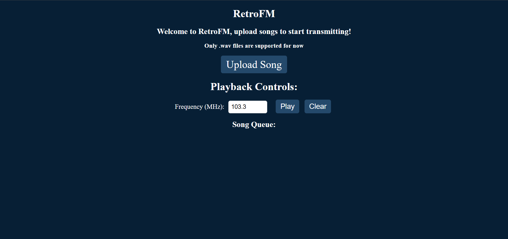

# RetroFM

A Raspberry Pi-based FM transmitter with a Wi-Fi control panel and a custom 3D-printed enclosure.


## What is RetroFM?

RetroFM turns a Raspberry Pi into a small FM radio station.

The Pi creates its own Wi-Fi network. You can connect to it from a phone or computer, open the web interface, upload audio, manage the queue, and control playback.

It doesn't need an existing Wi-Fi network once it's installed.

## Features

* FM transmission using PiFmAdv
* Web interface for uploading and managing audio
* Audio queue and playback controls
* Built-in Wi-Fi access point
* Captive portal
* RDS station information
* Automatic startup with systemd
* Installation and verification scripts
* Custom 3D-printable enclosure

## Web Interface

The web interface is designed to be used from a phone, tablet, or computer connected to RetroFM.



From the interface, you can:

* Upload audio files
* Add tracks to the queue
* Manage the queue
* Control playback
* Change the FM frequency

## Installation

### Requirements

RetroFM currently requires **Raspberry Pi OS Bullseye**.

This version is used because RetroFM's Wi-Fi access point setup depends on `dhcpcd`. Newer Raspberry Pi OS releases use a different networking setup, so Bullseye is currently the supported version.

You will also need:

* A Raspberry Pi
* A microSD card
* A suitable power supply
* A working Wi-Fi interface
* An FM antenna or suitable RF setup
* An internet connection during installation

The Pi must be connected to the internet **before running `install.sh`**. The installer downloads packages and dependencies during setup.

### Preparing Raspberry Pi OS

After flashing Raspberry Pi OS Bullseye, enable SSH before starting the installation.

Create an empty file named:

```text
ssh
```

with **no file extension** in the boot partition of the SD card.

The default hostname used in the setup is:

```text
raspberrypi
```

If you're using a different hostname or username, adjust the SSH commands below accordingly.

## Installing over SSH

There are several ways to get into the Pi before installation.

### Ethernet SSH

Connect the Pi to your network with Ethernet and SSH into it normally.

### USB SSH with `g_ether`

If you're using a Raspberry Pi Zero over USB, you can use USB Ethernet instead.

In the boot partition, add this immediately after `rootwait` in `cmdline.txt`:

```text
modules-load=dwc2,g_ether
```

Then add this to the bottom of `config.txt`:

```text
dtoverlay=dwc2
```

After booting the Pi, you can connect over USB with:

```bash
ssh pi@raspberrypi.local
```

These changes allow the Pi to appear as a USB Ethernet device when connected to a computer.

### Monitor and keyboard

You can also connect a monitor and keyboard directly to the Pi and run the installation locally.

## Install RetroFM

Once you're connected to the Pi, download the repository:

```bash
cd /tmp
curl -L -o retrofm.tar.gz https://codeload.github.com/itsjwinner7202/retrofm/tar.gz/main
mkdir -p /tmp/retrofm-install
tar -xzf retrofm.tar.gz -C /tmp/retrofm-install --strip-components=1
cd /tmp/retrofm-install
```

Then run:

```bash
sudo bash install.sh
```

The installer handles:

* Required system packages
* Node.js
* Node.js dependencies
* PiFmAdv compilation
* The RetroFM Wi-Fi access point
* The captive portal
* The RetroFM system service

The installer installs the project to `/opt/retrofm`.

## Installing over Wi-Fi SSH

If you're connected to the Pi through its normal Wi-Fi connection, there is one important thing to know.

First, install `screen`:

```bash
sudo apt-get install -y screen
```

Start a screen session:

```bash
screen -S install_retrofm
```

Then download and install RetroFM:

```bash
cd /tmp
curl -L -o retrofm.tar.gz https://codeload.github.com/itsjwinner7202/retrofm/tar.gz/main
mkdir -p /tmp/retrofm-install
tar -xzf retrofm.tar.gz -C /tmp/retrofm-install --strip-components=1
cd /tmp/retrofm-install
sudo ./install.sh
```

### Important: SSH will disconnect

During installation, RetroFM changes `wlan0` into the RetroFM access point.

This **will disconnect your current SSH connection**.

That's expected.

Because the installer is running inside `screen`, the installation continues in the background after your SSH connection drops. Don't assume the installation failed just because SSH disconnected.

## After Installation

Once the installation has finished, verify that everything was installed correctly:

```bash
sudo bash verify-install.sh
```

RetroFM should then create a Wi-Fi network named:

```text
RetroFM
```

Connect to that network from your phone or computer.

Then open:

```text
http://192.168.50.1
```

Supported devices should be redirected to the RetroFM interface through the captive portal.

If the automatic redirect doesn't work, open the address manually.

## SSH After Installation

You can still access the Pi through the RetroFM Wi-Fi network.

Connect to the `RetroFM` network and run:

```bash
ssh pi@192.168.50.1
```

This is useful for checking logs, restarting services, or troubleshooting without connecting another network cable.

## Troubleshooting

### The Wi-Fi portal doesn't appear

Check the RetroFM service:

```bash
sudo systemctl status retrofm.service
```

To watch its logs:

```bash
sudo journalctl -u retrofm.service -f
```

To restart it:

```bash
sudo systemctl restart retrofm.service
```

If you're troubleshooting after installation, make sure you're connected to the `RetroFM` Wi-Fi network first.

## Hardware and Enclosure

RetroFM is built around a Raspberry Pi and uses PiFmAdv for FM transmission.

The project also includes a custom enclosure designed around the Raspberry Pi Zero layout and antenna mount.

The STL file is available here:

```text
models/RetroFM.stl
```

You can print it yourself if you want to build the physical version of RetroFM.

## RF and Legal Notice

**Please make sure FM transmission is legal where you live before using RetroFM.**

Broadcasting on FM frequencies may require a license depending on your location. Using unauthorized frequencies or power levels can also interfere with other radio services.

The Raspberry Pi GPIO output also produces harmonics outside the intended FM frequency. A suitable **band-pass filter (BPF)** should be connected between GPIO 4 (Pin 7) and the antenna before transmitting.

The basic setup is:

```text
Raspberry Pi              Filter                Antenna
[ GPIO 4 ] ──────────▶ [ Band-pass ] ───────▶ [ Wire ]
[  GND   ] ────────────[   Filter   ]──────────[ GND ]
```

RetroFM is provided as-is for educational and experimental use. You are responsible for making sure your use of the project follows the laws and regulations that apply to you.

### Third-Party Software

RetroFM uses [PiFmAdv](https://github.com/ChristopheJacquet/PiFmAdv), an FM transmitter for Raspberry Pi, which is also licensed under GPLv3.

The RetroFM enclosure design included in this repository is released under GPLv3 as well.
